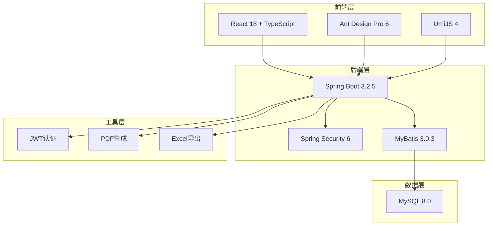
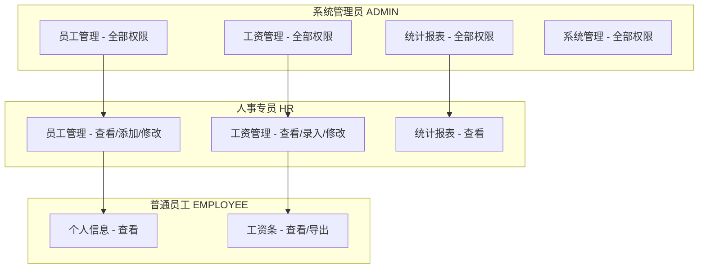
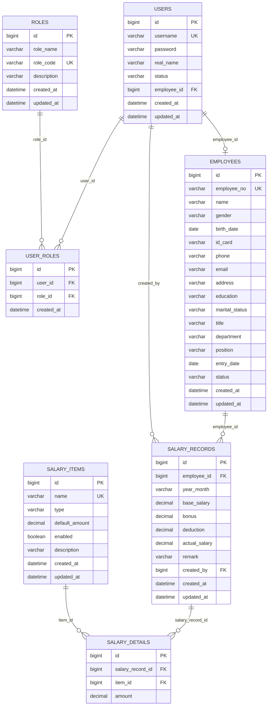
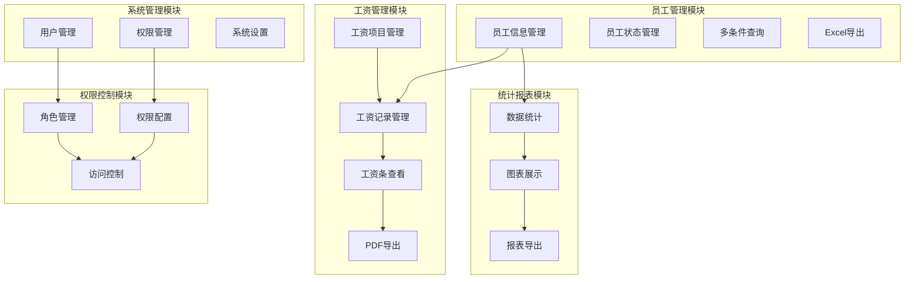
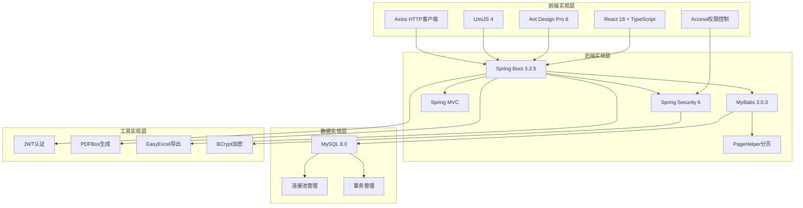

# HR管理系统架构图

## 图1：系统整体架构图

## 架构说明

### 前端层
- **React 18 + TypeScript**：现代化的前端框架，提供类型安全
- **Ant Design Pro 6**：企业级UI组件库，提供丰富的界面组件
- **UmiJS 4**：前端应用框架，提供路由、状态管理等功能

### 后端层
- **Spring Boot 3.2.5**：Java后端框架，提供快速开发能力
- **Spring Security 6**：安全框架，提供认证和授权功能
- **MyBatis 3.0.3**：ORM框架，提供数据访问层功能

### 数据层
- **MySQL 8.0**：关系型数据库，存储系统数据

### 工具层
- **JWT认证**：无状态认证机制
- **PDF生成**：工资条PDF导出功能
- **Excel导出**：数据报表导出功能

## 图2：用户角色权限图

## 权限说明

### 系统管理员（ADMIN）
- 拥有系统所有功能的完全访问权限
- 可以管理用户账号和角色
- 可以配置系统权限和设置
- 负责系统维护和升级

### 人事专员（HR）
- 可以管理员工信息和工资信息
- 可以查看统计报表
- 不能进行系统管理操作
- 不能删除员工和工资记录

### 普通员工（EMPLOYEE）
- 只能查看个人信息和工资条
- 可以导出PDF格式工资条
- 不能查看其他员工信息
- 不能进行任何管理操作

## 图3：数据库E-R图

## 图4：系统功能模块图

## 图5：系统实现架构图

## 实现说明

### 前端实现层
- **React 18 + TypeScript**：现代化组件开发，类型安全
- **Ant Design Pro 6**：企业级UI组件，响应式设计
- **UmiJS 4**：应用框架，约定式路由
- **Axios HTTP客户端**：API请求封装，拦截器处理
- **Access权限控制**：页面级和按钮级权限

### 后端实现层
- **Spring Boot 3.2.5**：自动配置，内嵌服务器
- **Spring Security 6**：安全框架，JWT认证
- **Spring MVC**：RESTful API，参数验证
- **MyBatis 3.0.3**：ORM映射，动态SQL
- **PageHelper分页**：分页插件，性能优化

### 数据实现层
- **MySQL 8.0**：关系型数据库，事务支持
- **连接池管理**：数据库连接优化
- **事务管理**：数据一致性保障

### 工具实现层
- **JWT认证**：无状态认证，令牌管理
- **PDFBox生成**：PDF文档创建，中文处理
- **EasyExcel导出**：Excel文件生成，大数据处理
- **BCrypt加密**：密码安全存储
